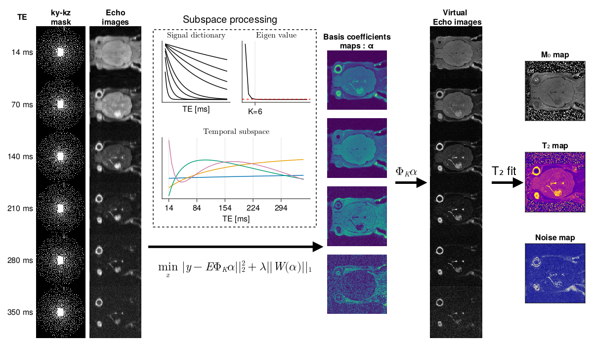

```@meta
CurrentModule = Subspace_MESE
```

# Subspace_MESE

Documentation for the [Subspace_MESE](https://github.com/aTrotier/Subspace_MESE.jl) package, which implements the necessary functions to convert and reconstruct an accelerated 3D Multi-Echo Spin-Echo sequence with a subspace reconstruction in order to generate **T2** maps.


## Bruker Acquisition

This package is compatible with the sequence : **a\_MESE\_CS** which is available as a binary file in the folder : `MRI/PV6.0.1/`

The sequence is only available for the version PV6.0.1, implementation under PV360.6.5 is in progress.
The protocol used for an acceleration factor of CS=6/8/10 is also available.

## Reconstruction Pipeline

The reconstruction pipeline includes 4 steps :
- Conversion of the Bruker rawdataset to a MRIReco compatible format (`/src/bruker_sequence.jl`)
- Generation of the subspace (`/src/build_basis.jl`)
- Reconstruction of the subspace coefficient and the virtual echo images
- T2 fitting (`/src/fit_T2_MESE.jl`)



Those steps are described in their dedicated sections.

# Example

Reproduction of figure 8 can be performed at this link : https://atrotier.github.io/PAPER_subspace_MESE/dev/generated/examples/subspace_julia_epg/